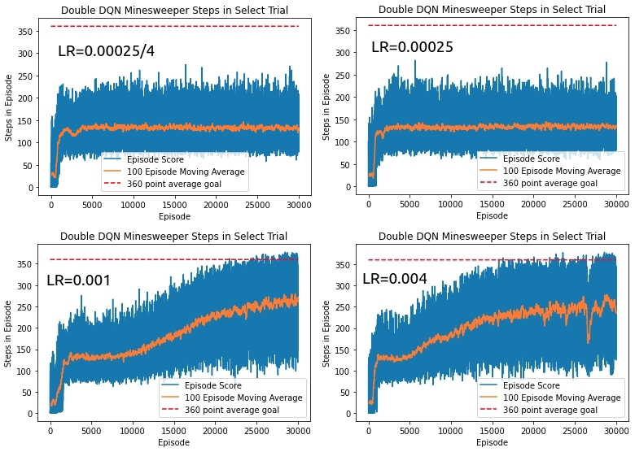
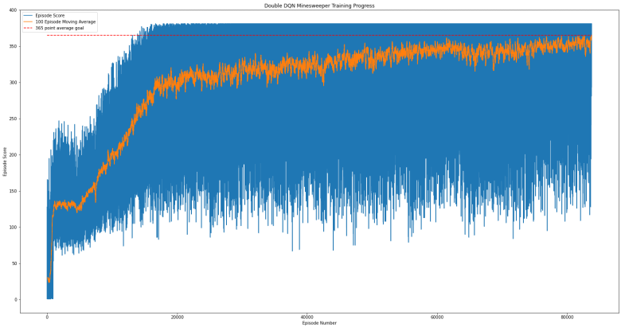
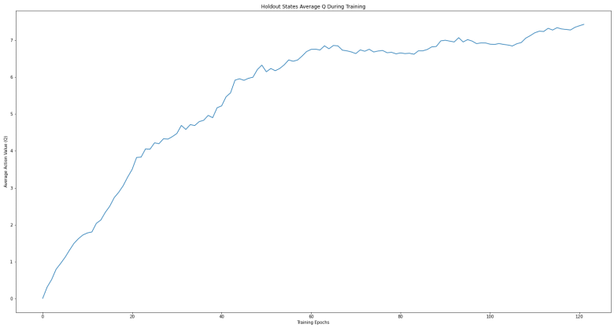

# Using a Double Deep Q-Network to Learn to Play Minesweeper

## Overview
I trained an agent to play Minesweeper on expert difficulty using a DDQN.  The agent achieves a win rate of **23.60%** over 25,000 games played.  This required about 10 days of training on a laptop with an Intel Core i7-6820HQ CPU @ 2.70GHz and an NVIDIA Quadro M2002M GPU (CUDA Compute Capability 5.0).

I wrote the code in Python 3.7 and used Keras 2.3.1 (GPU-enabled with Tensorflow backend), PyGame 1.9.6, and Matplotlib 3.2.1.  A **requirements.txt** file is included for convenience, but these should be the only packages required.   

My programming approach follows the OpenAI Gym style.  Their philosophy is to create an environment that is agent-agnostic and simply returns state and reward information in response to the agent's actions.  I have used the OpenAI Gym methods and terminology in my Minesweeper class including common methods such as `step()`, `reset()`, and `render()`.  The Python files of interest are:

 * **minesweeper** is the agent-agnostic environment which contains all of the functions related to the game of Minesweeper, including a PyGame GUI. 
 * **DDQN** represents all of the functions required by the agent.
 * **train_minesweeper** imports and instantiates the Minesweeper environment and the DDQN agent for training.  It contains all of the hyperparameters and environment settings.
 * **play_minesweeper** imports a saved neural network model and uses it to play Minesweeper.  The user can watch the agent play games of Minesweeper in real time with the PyGame GUI, or can have the agent play many thousands of games without the GUI in order to benchmark the agent's performance.

The following sections discuss the reasoning behind the architecture and hyperparameters I chose, as well as some of the (at times painful) lessons I learned.  See the final section for an explanation of a mine generation bug that I didn't catch until after the initial commit of this document.

## Reinforcement Learning with a DDQN
The appeal of Q-learning is that the agent can directly learn from experience without needing a model of the environment's reward and next-state probability distributions (such as with Monte Carlo methods).  In fact, the agent need not know anything about the environment or the task it is performing.  It learns the desired behavior by maximizing the total amount of reward it receives when interacting with the environment.  The agent estimates the "Q-value" of taking a particular action in a particular state.  Included in the Q-value is not just the immediate reward of taking that action, but also an estimate of the discounted future rewards it expects to receive in future states given that action.  In tabular Q-learning all possible state/action combinations are stored in memory to keep track of the estimated Q-values.  The number of state/action combinations in complicated tasks may be so enormous that it's not possible to store them all in memory.  Deep Q-learning solves this problem by using a neural network as a "function approximator" that can learn to make generalizations from experience and predict the Q-value for a particular state/action without needing to store all possible combinations in memory.  This is an appealing approach for Minesweeper as there are a very large number of possible state/action combinations.
  
### Problems with Q-learning
[Sutton and Barto](http://incompleteideas.net/book/RLbook2020.pdf) identify a general problem with Q-learning known as "maximization bias."  Although the example they use to explain maximization bias is highly contrived, the idea is that in a stochastic environment the agent might take a bad action that happens to receive a positive reward.  On average this decision is never the right choice, but because it received a reward that was a statistical outlier the agent will believe that it was a good action to take.  This can slow learning because the Q-learning algorithm always chooses the action that provides the maximum Q-value, and so it will keep choosing this bad action until its estimated Q-value drops below the next-best action.  One solution to this problem is to implement a second neural network that is trained on a different subset of the data than the first network.  It's unlikely that both networks will see a positive statistical outlier for the same state/action combination.  The two networks then work in tandem during training; this is the reason for the name *double* deep Q-learning.  Because of Minesweeper's highly stochastic nature it may also have issues with maximization bias, and so implementing a double Q-network seems like a reasonable precaution.
  
 A problem with *deep* Q-learning in particular is what Sutton and Barto have called the "deadly triad."  The deadly triad is the combination of function approximation, bootstrapping, and off-policy training tending to cause instability and divergence during training.  Deep Q-learning features all three elements of the deadly triad and would thus seem susceptible to these convergence problems.  However, DeepMind [published a paper](https://arxiv.org/pdf/1509.06461.pdf) demonstrating that a DDQN could successfully learn how to play several Atari games with a performance level that matched or exceeded human performance.  It was shown to significantly reduce maximization bias compared to a single deep Q-network, and did not appear to suffer from any convergence issues.  DeepMind monitored the agent's stability by repeatedly evaluating the average of the maximum Q-value of a fixed set of states during training.

I  used DeepMind's DDQN approach to Atari games as the baseline for my attempt to train an agent to learn Minesweeper.  Like DeepMind, I used a Convolutional Neural Network (CNN) architecture and experience replay to train the agent.  I also monitored agent convergence by evaluating the Q-values of a holdout set of states.  I did not initially follow their approach of training a single "online" network and periodically copying its weights to a "target" network.  Instead I alternated between training two separate neural networks as described by Sutton and Barto in section 6.7 of their book.

### Prioritized Experience Replay
In the previously mentioned DeepMind paper, experience replay was utilized to uniformly sample from the agent's past experience.  The benefit of this sampling is that it breaks temporal correlations amongst training data, and it allows the possibility of training on a particular experience more than once rather than immediately "forgetting" it.
DeepMind [later published a conference paper](https://arxiv.org/pdf/1511.05952.pdf) demonstrating the utility of a concept called *prioritized* experience replay (PER).  The idea is that some experiences are more significant than others, and that uniformly sampling from the agent's pool of experience is an inefficient method of learning.  Experiences that are expected to provide a larger amount of learning can be re-used more frequently to train the neural network more quickly.

I observed that my Minesweeper agent's learning slowed to a crawl just as it became good enough to occasionally win a game.  Even after more than 24 hours of training the agent remained plateaued at a win rate of 5-10%.  It also routinely lost games on the very last move (380 of 381 tiles revealed).  After some reflection, I realized that as the agent became better at Minesweeper it played many more moves per game.  This fills up the experience replay memory with many examples of intermediate moves, but very few examples of game-ending moves (winning or losing) as they only occur once per episode.  Uniform sampling treats all of these experiences equally, and so the more critical game-ending experiences are much less frequently sampled and used for training. 

I decided to implement PER for this reason.  I chose to use proportional prioritization with a clipped TD-error term as outlined in the DeepMind paper.  The prioritized experiences are efficiently sampled using a "sum-tree" data structure written by @jaromiru.  Finally, I implemented weighted importance sampling to compensate for experiences with high priorities so that their repeated re-sampling does not introduce bias.  This approach seemed to preclude alternating training between two neural networks, and so I switched to the DeepMind online/target network weight-copying approach instead

## State Representation
The Minesweeper agent did not learn on images or frames from a Minesweeper GUI like DeepMind's agents did with Atari games.  I directly represented the Minesweeper game state numerically rather than add the complexity and computation time of learning from a graphical input.  I wrote a Minesweeper game engine in Python and represented the tile values as a Numpy array of integers.  Tile values 0-8 were represented by their respective numbers, an unrevealed tile was represented by the number 9, and a mine was represented by -1.

The Minesweeper grid state must be represented in a way that can be understood by a neural network.  I was initially tempted to directly input the tile values into the neural net as these numbers are not just categories but represent a valid cardinal numerical relationship.  For instance, a tile of value 4 really does indicate 4 times more adjacent mines than a tile of value 1.  The stumbling block for me there was how to represent unrevealed tiles to the neural network.  Any numerical value I used for this state could be interpreted as having a cardinal relationship to the other tile states, which might cause problems during training.  I considered the possibility of combining numeric and categorical data types using some sort of ensemble or multiple input approach, but ultimately decided that representing the Minesweeper grid using one-hot encoding was the most straightforward approach.  A tile's value is represented by 9 dimensions that encode the values 0 through 8.  An unrevealed tile is implicitly encoded as being zeros in all 9 dimensions.  This avoids the [dummy variable trap](https://en.wikipedia.org/wiki/Dummy_variable_(statistics)#Incorporating_a_dummy_independent).  No state indicator is needed for a mine, because hitting a mine is a terminal state and immediately ends the game.  The agent does not know what was beneath the tile; it only knows that it received a negative reward for selecting it.

The one-hot encoded state is needed to train the neural network, but is too complicated to use to keep track of the game state.  Instead, the original Numpy array of integers is used to represent the game state in the Minesweeper environment.  Each experience stored in memory includes both the original integer array and the one-hot encoded array.  This increases the memory footprint, but saves computation time during training by not requiring the state to be converted to the one-hot encoding every time an experience is sampled.

The output of the neural network is a flattened 1D array of 480 Q-values.  The index of each Q-value in this "action array" corresponds to one of the 480 tiles in the 16x30 Minesweeper grid.  The agent is prevented from choosing an already-revealed tile by representing the possible actions as a Numpy masked array.  The indices of the revealed tiles in the integer Numpy state array are used to "mask" the corresponding indices in the action array.  These masked actions are not visible to the agent, and thus the agent will only be able to choose from valid moves.  The agent will follow the Epsilon-Greedy behavior policy and choose the valid move with the highest estimated Q-value.
 

## Initial Neural Network Architecture
My approach uses a Convolutional Neural Network (CNN) to approximate the action-value function (Q-value).  CNNs are typically comprised of several convolutional layers followed by fully-connected (FC) layers at the output.  This is common in many state-of-the art CNNs in the literature (VGG16, ResNet, AlexNet, GoogLeNet, etc.). As discussed in [Szegedy et al.](https://arxiv.org/pdf/1409.4842.pdf): 
>Variants of this basic design are prevalent in the image classification literature and have yielded the best results to-date on MNIST, CIFAR and most notably on the ImageNet classification challenge.

Although Q-learning is a regression task rather than a classification task, I chose to use this CNN architecture as a starting point for learning Minesweeper because of the similarity between the Minesweeper grid and digital representations of color images.  A color image is 2D array of pixels where each pixel's color is represented by 3 channels (RGB).  The Minesweeper grid is a 2D array of tiles where each tile's numeric value or state can be represented by multiple channels.  From the [Deep Learning Book chapter on CNNs](https://www.deeplearningbook.org/contents/convnets.html):
>Similarly with images, convolution creates a 2-D map of where certain features appear in the input. If we move the object in the input, its representation will move the same amount in the output. This is useful for when we know that some function of a small number of neighboring pixels is useful when applied to multiple input locations.

This describes exactly what a player looks for when choosing a tile to select in Minesweeper.  The neighboring tiles contain information that can be used to determine whether the tile of interest is definitely a mine, is definitely not a mine, or could be either (insufficient information).  This analysis is applied to every unrevealed tile on the game board.  The CNN's kernels can be trained to identify various features of interest that would indicate to the neural net whether a tile is likely a good or bad choice.  A 3x3 kernel captures all 8 neighboring tiles.

In addition to the convolution operation, a convolutional layer is sometimes defined to include a detector stage and a pooling stage.  The main benefit of pooling is translation invariance:  
>Invariance to local translation can be a useful property if we care more about whether some feature is present than exactly where it is. . . .  In other contexts, it is more important to preserve the location of a feature.

For Minesweeper, clearly the exact location of a feature is critical.  A one-tile translation to the left or right could result in a game-ending misplay.  Pooling (and stride > 1) is omitted from the neural network architecture for this reason.  The activation function is chosen to be the Rectified Linear Unit (ReLU).  Relu is commonly used in the literature and has advantages over other popular activation functions such as the Sigmoid.  

The fully-connected layers follow the flattening of the last convolutional layer, and are responsible for most of the trainable parameters in this architecture.  CNNs in the literature typically have 2 or 3 FC layers followed by a softmax output layer for classification.  I initially adopted this approach, but replaced the softmax layer with a FC output layer with a linear activation function for regression.  This is also the architecture that Deepmind used to learn to play Atari games.

Finally, as this a *double* deep Q-network, there are two copies of this neural network used during training.  I adopt the terminology "online network" and "target network" from DeepMind's papers.  Only the online network is trained; the weights from the online network are then periodically copied to the target network.  During experience replay the online network *selects* the action taken in the next state, and the target network *evaluates* the estimated Q-value of that action/state combination.

## Final Neural Net Architecture
Unfortunately, all of my initial attempts to learn Minesweeper failed.  In fact, the agent never achieved an average score much above the low 100s even after hundreds of thousands of games.  The holdout states showed that while the average Q-value initially increased, it eventually plateaued and then plummeted in value.  This is an indicator that the DDQN is diverging rather than converging to a solution.  Varying the hyperparameters and altering the number of layers in the model did not change this outcome.

I was making an obvious mistake, but it wasn't until I took a closer look at [Ryan Baldini's](https://github.com/ryanbaldini/MineSweeperNeuralNet)  model architecture that I realized it.  @ryanbaldini only used convolutional layers in his NN model.  I realized then that using FC layers at the output of the network defeats the purpose of using convolutional layers entirely.  The key advantage of a convolutional layer is that it is a sparsely connected network.  This means that only the immediate neighbors of a particular tile play a role in predicting its action-value (Q-value).  Fully-connected layers at the output connect every tile to every other tile on the game board.  This means that a tile in the top-right corner of the Minesweeper grid has trainable parameters that can affect a tile in the bottom-left corner, and vice versa.  A tile cannot provide any useful information unless it is immediately adjacent to the tile of interest, and so these trainable parameters should all be zero.  But the agent does not know this, and in general the neural network will make false associations between distant tiles that should not exist.  The result is that the agent is confused by erroneous relationships that it perceives in the training data, and learning slows to a stop and begins to diverge.

This was an especially painful lesson for me, because I had spent many hours developing a windowing algorithm to split the grid into smaller sub-grids to reduce the number of trainable parameters.  All of this work turned out to be useless, because the number of parameters per convolutional layer is only based on the dimensions of the kernel and the number of input channels.  The size of the grid or image does not impact the number of trainable parameters:

`Parameters per Conv2D layer = (kernel_H * kernel_W * num_input_channels + 1 bias) * num_kernels`

The final architecture is 7 Conv2D layers with 64 3x3 kernels and the ReLu activation function.  The output layer is a Conv2D layer with a single 1x1 kernel and a linear activation function, which produces 480 outputs for a 16x30 Minesweeper grid.  This final layer is flattened so that the output is a 1D array.  All convolutional layers are padded to prevent a reduction in the grid dimensions.  The total number of trainable parameters is 226,881.

## Minesweeper Mechanics
The agent learns to play Minesweeper on an expert grid, which is 16x30 tiles with 99 randomly placed mines.  The player must select unrevealed tiles to progress further in the game, but revealing a mine ends the game immediately.  Revealed tiles contain an integer number that represents the number of mines adjacent to that tile.  Revealing more tiles provides the player with more information, but also means that there are fewer safe tiles to choose from.  All 381 safe tiles must be revealed in order to win the game.  A 100% win rate is impossible because some games require blind guessing to win.  The first move in Minesweeper is always a safe tile, and so the positions of the mines are generated after the player has made this first move.  A human player has the ability to "flag" tiles that he believes may contain a mine.  There is no need for the agent to flag mines, as the neural network should learn to identify these tiles as having low rewards and thus avoid choosing them.  Since the flag icon is more of a convenience for human players it is not implemented here.

Another interesting mechanic is encountered when a player reveals a "zero" tile.  The zero tile means that no adjacent tiles are mines, and so these adjacent tiles are automatically revealed as well.  If one of these adjacent tiles is also a zero tile, all of its adjacent tiles will be revealed, too.  And so on, in a chain reaction.  This auto-reveal mechanic lead to unexpected agent behavior because of the way I initially structured the reward system.

### Reward Structure
DeepMind recommended clipping reward values to +/-1 when using prioritized experience replay to help ensure agent stability.  To follow this guideline, I set the reward for revealing a safe tile to +0.1, to revealing the final game-winning safe tile to +1.0, and to revealing a mine to -1.0.  My reasoning was that revealing a mine should have a negative reward that is substantially larger in magnitude than revealing a safe tile to discourage the agent from randomly guessing.  By the same token, winning the game should result in a large positive reward.  In temporal difference methods, terminal states do not have discounted future rewards added to their immediate reward because there is no future state.  I wanted to make sure that the game-winning move still had a substantial positive reward even without the discounted future reward.

After implementing the PyGame GUI to watch the trained agent play Minesweeper, it seemed like the agent was learning to just randomly pick in the middle of a bunch of unrevealed tiles.  It would continue this behavior until it hit a mine.  I eventually realized the culprit was the auto-reveal routine that occurred whenever a zero tile was revealed.  I had set the Minesweeper environment to reward the agent with +0.1 for every tile revealed during this routine.  It's not unusual for dozens of tiles to be revealed during an auto-reveal at the beginning of the game, and so the reward for randomly clicking unrevealed tiles on average outweighed the penalty of eventually hitting a mine.  I corrected this by only rewarding the agent with +0.1 for selecting a zero tile, with no further reward regardless of how many tiles were auto-revealed.  The agent then learned very quickly how to properly play the game rather than randomly choosing unrevealed tiles.

## Tuning Hyperparameters
Training the agent can require several days, and so fully optimizing all of the hyperparameters isn't feasible.  However, I was able to get a feel for which hyperparameters were the most important for speeding up learning.  The following sections summarize my findings.  Note that these findings were made prior to discovering the mine generation bug discussed in the final section.

### Epsilon-Greedy Behavior Policy
I allowed epsilon to decay to zero for the agent's Epsilon-Greedy policy for two reasons:
 1.	The stochastic nature of Minesweeper naturally introduces random exploration as each game randomly generates the position of the mines.
 2.	One mistake in Minesweeper ends the game.  A large minimum epsilon value could prevent the agent from ever making enough progress to learn how to reliably win a game.

However, allowing epsilon to decay too quickly did seem to slow initial learning.  The agent's learning pattern is a sharp increase in score very early in the learning process followed by getting "stuck" once it reaches an average score of around 130 points.  With an epsilon decay of 0.99 the agent escaped this plateau in under 10,000 episodes.  With an epsilon decay of 0.9 the agent required about 20,000 episodes to begin improving again.  It seems that the agent is initially learning some aspect of the game that allows it to significantly improve its score compared to random chance, but is not a viable play style beyond the very early portion of the game.  The agent then has to "unlearn" this gimmick and take a more intelligent approach.  I suspect that random exploration is critical to speeding up learning at this early stage.

### Number of Update Steps
DeepMind's [original Atari paper](https://arxiv.org/pdf/1312.5602.pdf) trained the neural network every 4 steps with a batch size of 32.  This is an 8-to-1 ratio of samples trained to new steps taken.  Perhaps this makes sense for a real-time Atari game, but for a turn-based game like Minesweeper the terminal state is where the most learning occurs because this is where the agent has made a mistake.  As the agent improves, each game of Minesweeper requires more steps before reaching this terminal state.  Updating every 4 steps would slow learning to a crawl as new information would trickle in incredibly slowly.  Instead, I increased the batch size to as large as my GPU could handle, and increased the number of steps between updates proportionally.  DeepMind's original paper also used a learning rate of 0.00025 with uniform experience replay.  With PER, they decreased the learning rate by a factor of four (0.00025/4).  I kept the learning rate at 0.00025 even with PER, and maintained the 8-to-1 ratio between training steps and playing the game.  After 48 hours of training, the agent seemed to have plateaued around an average score of 300 points.  I then paused the training and changed this ratio to 2-to-1 (512 steps between updates with 1024 states in a minibatch).  This helped speed up the training such that the agent eventually reached a 35% win rate after about 60 hours of training.

The other important parameter is the number of steps between updates of the target network.  DeepMind set this to 10,000 steps, which works out to their online network being trained on 80,000 samples between each target network update.  I set the target network update parameter to occur once for every 80 times the online network is trained.  The minibatch size is 1024 samples, and so this works out to the online network being trained on roughly 80,000 samples between target network updates.

### PER Hyperparameters
DeepMind's paper recommended an alpha of 0.6 for the proportional priority method, and an initial beta of 0.4 annealed to 1.0 over 10 million steps.  I used these parameters as-is without tweaking, but did experiment with increasing alpha to 0.8.  Increasing the alpha parameter increases the amount of prioritization used during experience replay.  I found that increasing alpha in effect behaved very similarly to increasing the learning rate.  The agent learned more quickly with a higher alpha, but appeared to experience a "dropout" in its average score at the end of 30,000 episodes.  I left alpha at 0.6 as a consequence.

### Learning Rate
The learning rate turned out to be by far the most important hyperparameter, both for speeding up the agent's learning and for achieving a high win rate.  I performed a study of the impact of learning rate by allowing the agent to train for approximately 30,000 episodes at five different learning rates.  Four of those trials are shown in the image below.  The two lowest learning rates (0.00025/4 and 0.00025) were those suggested by DeepMind in their Atari and PER papers.  As can be seen in the image below, the average score quickly plateaued around 130 points and did not increase after 30,000 episodes.  The two higher learning rates (0.001 and 0.004) break this plateau after several thousand episodes.  Learning then progresses fairly smoothly for the learning rate of 0.001, but the higher learning rate of 0.004 begins to experience "dropouts" in its average score and average Q-values.  The fifth trial at a learning rate of 0.008 actually learned more slowly than the 0.001 case and achieved a lower average score after 30,000 episodes.

Based on these results, I wrote a function to decay the neural network's learning rate in a piecewise-linear fashion.  This allowed me to begin training with an aggressive learning rate of 0.004, but gradually reduce it to lower values at different stages of the training process.  The top plot below shows that the average score (orange trace) increased sharply and reached over 300 points within the first 30,000 episodes.  This is higher than both the 0.004 and 0.001 constant learning rates, which only achieved an average score of about 250 points after 30,000 episodes.

The second plot is the stability metric used by DeepMind.  The fixed set of holdout states are periodically evaluated during training.  The average estimated Q-value of these states increased over time without any significant dropouts, which indicates that the agent's learning was stable.  As the agent converged on a solution the Q-value curve begins to level off.  However, there was still a slight upward trend to the plot that suggests that if training had continued there might still be performance gains to be had.  Note that these plots were produced *before* discovering the mine generation bug.  I believe the conclusions still hold true, and that decreasing the learning rate in a piecewise fashion is a good approach.  However, after fixing the mine generation bug I found that I needed to reduce the magnitude of the learning rates that I used to get a smooth average Q-value plot.

## Discussion of Results
The animated GIF at the beginning of this document shows the PyGame Minesweeper GUI in action.  The user can specify how many games the agent plays and how much time delay there is between the agent's moves.  A transparent yellow rectangle highlights the tile that the agent intends to select next turn.  Every unrevealed tile has a circle drawn on it that visually represents the expected Q-value of that tile.  A large blue circle represents a high positive Q-value (probable safe tile).  A large red circle represents a high negative Q-value (probable mine).  Small black circles represent tiles that have a Q-value close to zero and are thus tiles that the agent is unsure about.

The PyGame GUI can be disabled with a simple Boolean toggle to allow for benchmarking of the agent's performance.  The agent will play the user-specified number of games without a graphical interface, and the win rate will be displayed in the console in real time as the agent completes games.  I calculated the final win rate benchmark over 20,000 games played to ensure that the sampling error does not significantly affect the results.

Because calculating the true win rate requires so many games played it cannot be used as the solve condition for training.  Instead, I set the solve condition to be an average score of 365 points over 100 consecutive games.  This is a somewhat arbitrary solve condition, but one that is common for many OpenAI Gym environments.  The alternative is to follow the DeepMind approach of allowing the agent to train for a fixed number of training steps or episodes.  I ended up stopping the training after an arbitrary number of episodes after discovering the mine generation bug.  The solve condition of an average of 365 points over 100 games was impossible to reach once the bug was fixed.  Instead, I monitored the average Q-value of the holdout states until it appeared to have plateaued.  

### Comparison to other Minesweeper learning projects
Many Minesweeper solvers exist, but relatively few utilize deep reinforcement learning to solve Minesweeper on expert difficulty.  More common are algorithm-based solvers that often use a combination of heuristics and probability analysis.  These algorithmic Minesweeper solvers tend to boast win rates in the high 30% to low 40% range on expert difficulty.  This seems to be close to the best possible win rate; solvers that claim higher win rates invariably are not playing on expert difficulty or based the win rate off of a trivial number of games played.  @DavidNHill [wrote a solver](https://github.com/DavidNHill/Minesweeper) that achieves a 40% win rate (although he does not specify over how many games played).  @mrgriscom [published a solver](https://github.com/mrgriscom/minesweepr/) that achieved a 37.8% win rate over 100,000 games.

@ryanbaldini used deep reinforcement learning to train an agent that achieved a win rate of "around 42%."  He does not state how many games the agent played to attain that figure.  Ryan also cites [a blog post](https://luckytoilet.wordpress.com/2012/12/23/2125/) where a solver claims a 50% win rate, but upon closer inspection this was over a mere 67 games played and can't be regarded as a valid benchmark.  It's interesting to note that while @ryanbaldini used deep reinforcement learning to train his agent, he did not use Q-learning.  Instead, he apparently trained the neural network to predict the percentage chance of a tile containing a mine.  The output layer of his neural network used a Sigmoid activation function for this reason.

The DDQN agent's win rate of 23.60% over 25,000 games is significantly lower than these other solvers.  Some possible reasons for this are discussed in the next section.

### Future Work
Minesweeper displays a count of the mines hidden in the grid.  The mine count is decremented as the player flags tiles he believes are mines.  [This blog post](https://luckytoilet.wordpress.com/2012/12/23/2125/) points out that in certain end-game situations knowing the total number of mines can occasionally eliminate the need to blindly guess.  My implementation of Minesweeper does not tell the agent how many mines are present in the grid.  It's possible that providing this information to the agent could improve its win rate.  [Drew Roos](https://mrgris.com/projects/minesweepr/) (@mrgriscom) also makes the observation that starting the game in the middle of the grid may not be optimal.  Instead, the optimal first move may be along the edge of the grid to increase the chances of hitting a hidden zero tile and opening up "a run" of tiles.  Before I discovered the bug in my code I had hard-coded the environment to always choose the middle tile as the first move.  Allowing the agent to learn what the optimal first move is could improve the win rate.

DeepMind [published a paper](https://arxiv.org/pdf/1710.02298.pdf) examining several ostensible improvements made to the DQN algorithm.  Two of the techniques are already implemented in my approach, namely double DQNs and prioritized experience replay.  Two other techniques (multi-step learning and distributional Q-learning) were shown to significantly improve the agent's learning speed and final performance on more than 50 Atari games.  Incorporating these techniques into my existing code may result in similar improvements on Minesweeper.

## Acknowledgments
This project has been a very gratifying experience for me, and it wouldn't have been possible without the numerous resources that are freely available online.  My introduction to reinforcement learning came from Sutton and Barto's tremendous [Reinforcement Learning](http://incompleteideas.net/book/RLbook2020.pdf) textbook, available for free on their website.  A great primer on deep learning is the aptly named [Deep Learning Book](https://www.deeplearningbook.org/), which is also free to view online.  And of course thanks to the team at [DeepMind](https://deepmind.com/), whose multiple papers on deep Q-learning were critical for implementing a successful Minesweeper agent.

In addition to the academic literature, the GitHub community has been a fantastic resource.  Thanks to @lsimmons2 for his implementation of a [DDQN for cartpole](https://github.com/lsimmons2/double-dqn-cartpole-solution/blob/master/double_dqn.py), which I referenced when writing my DDQN code for Minesweeper.  Thanks also to @jaromiru for his [sum-tree implementation](https://github.com/jaromiru/AI-blog/blob/master/SumTree.py) which I used (with accompanying MIT license) to implement prioritized experience replay.

## Mine Generation Bug
I realized that I had made a mistake during the mine generation process a few hours after the initial commit of this code.  I originally generated the index of the mines using the Random `randint(low, high)` method where low and high are both *inclusive*.  I later switched to Numpy's implementation of `randint(low, high)` where low is *inclusive* but high is *exclusive*.  Unfortunately, I did not catch this difference at the time.  As a result, the bottom row and right column of the grid never generated any mines.  The agent learned this bug early on, and that explains the sharp increase in average score in the beginning of training.  This may have invalidated some of the conclusions that I drew in the section on hyperparameter tuning, but I have allowed these sections to remain with a disclaimer.  While fixing the mine generation bug I decided to allow the agent to choose its first move instead of having it always be played as the center tile.  I was curious what the agent would decided was the best starting tile.  The agent seemed to prefer choosing a corner as its first move, but its win rate never reached 20%.

Why might letting the agent pick first the first tile hurt performance?  In Minesweeper the first move is always safe, and all tiles are unrevealed.  The agent should learn that guessing is dangerous, and that it should use information from revealed tiles to make an intelligent choice.  And yet, every new game it must guess from a grid of unrevealed tiles, and it always "gets it right."  Perhaps that somehow prevents the game from making the correct associations it needs to get a high win rate.  I did notice that the agent made a few inexplicable moves in the late game that resulted in a loss.  

I then set the Minesweeper environment to always choose a corner as the first move.  However, the win rate again did not exceed 20%.  It's possible that the corner itself is not an optimal location for a first move.  I then tried setting the first move to always be along the top edge of the grid.  I found that the learning rate seemed to be too high and the average Q of the holdout states oscillated quite a bit over time.  I reduced both the final learning rate and the PER alpha parameter during training, which resulted in resulted in the 23.60% win rate.

This final result is disappointing compared to algorithm-based solvers, and it's possible that better performance could be obtained by continuing to optimize the agent's hyperparameters.  Also, choosing a tile in the middle of the grid as the first move might have been the optimal choice after all, but I did not go back and check this possibility.  After nearly two months of tweaking and training I have decided to accept this result and move on.

